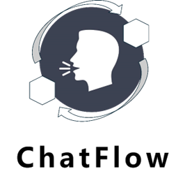
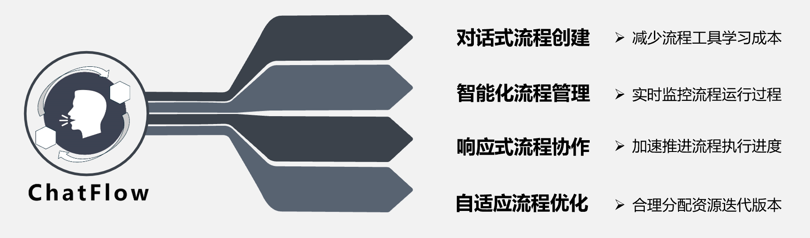
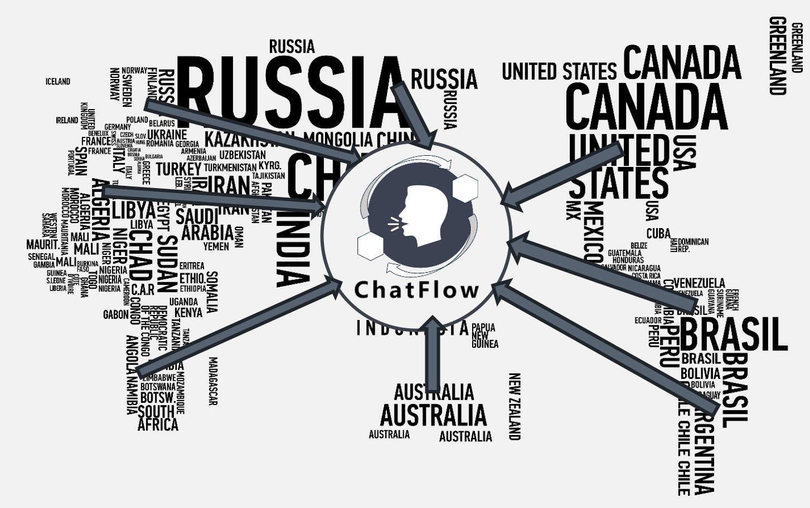
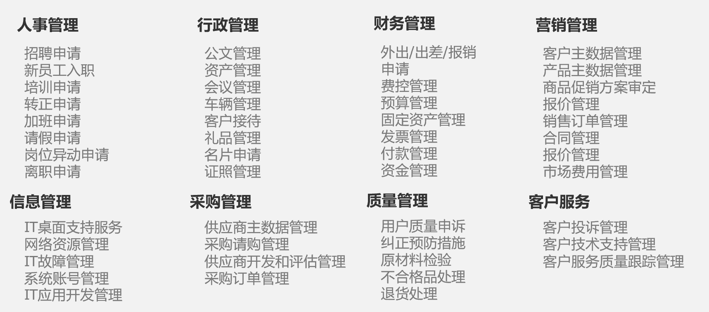
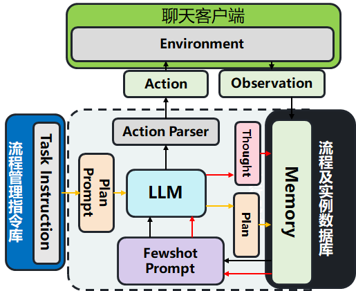
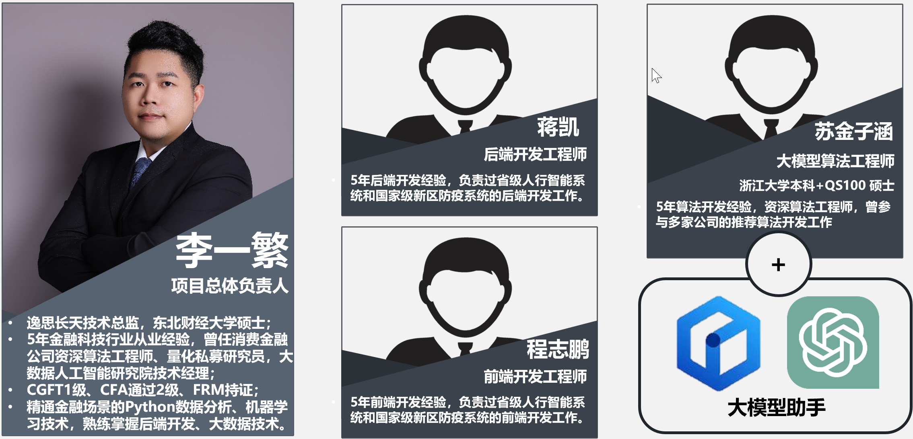

  
   基于大模型的智能流程管理工具

# 项目简介

**ChatFlow是基于大模型的智能流程管理工具**

本产品作为流程管理领域的LLM Agent，可以通过对话交互的方式，帮助组织轻松实现<u>工作流任务的智能搭建</u>、<u>工作环节人员的科学管理</u>，从而帮助用户以对话的形式<u>快捷地完成事务办理</u>，提升工作流运转效率和用户满意度水平。

- 项目Demo地址：http://139.198.30.225/

# 项目价值

使用ChatFlow可以仅通过对话智能创建流程、管理流程、协作和优化流程。

ChatFlow作为基于大模型的Agent可以解决国际跨语言场景协作的难题。

ChatFlow可以满足大量实际场景中的流程协作需求。

# 技术架构

ChatFlow由大模型、指令库、客户端、数据库共同组成了流程管理的 LLM Agent

# 团队成员

- 李一繁，负责整体项目运作，github：fcncassandra，微信号：afan-life

- 蒋凯，负责后端开发，github：j5255089

- 程志鹏，负责前端开发，github：ChzpMax

- 苏金子涵，负责大模型算法，github：sujinzihan

